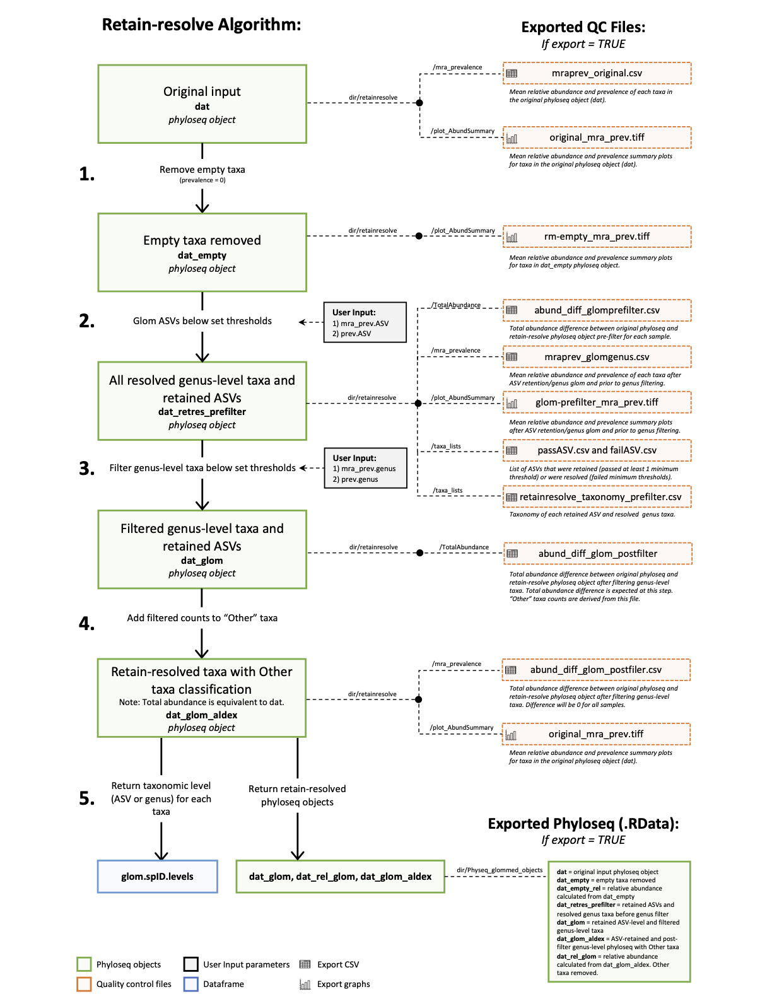
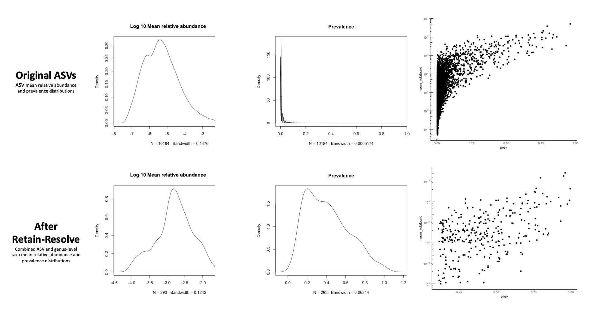

# retainresolve
Retain-resolve agglomeration algorithim for 16S sequencing data. 

 
 ## About 

This R package has been developed to conveniently execute the retain-resolve agglomeration algorithm described in the manuscript: Mapping microbiota to clinical anxiety (Chin Fatt et al, 2022). The retain resolve algorithm requires ASV-level 16S count data stored as a phyloseq object. Users input parameters for ASV-level and genus-level filtering thresholds. The main output is a phyloseq object containing a mix of retained ASV-level and resolved genus-level taxa and their counts. 

## Install
devtools::install_github("SarahAsbury/retainresolve")

## Use
Once package is installed, use following command in R for retain-resolve function documenation:

?retain.resolve_genus

Documentation is also available at: 
https://rdrr.io/github/SarahAsbury/retainresolve/man/retain.resolve_genus.html

## Summary

*Higher quality PDF available also available for download in repository (retainresolve_algorithim.pdf).*

## Example of mean relative abundance and prevalence distributions after retain-resolve

mra = taxon mean relative abundance 
prev = taxon prevalence 
